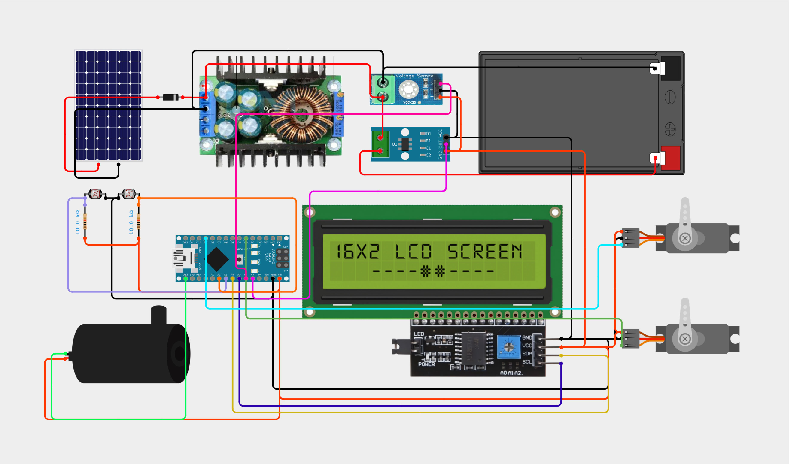

# 🌞 Solar Tracking System with Monitoring and Cleaning

This project is a smart **solar tracking system** built using **Arduino Nano**, designed to automatically track the sun, monitor system performance, and clean solar panels for optimal energy efficiency. It features **real-time display**, **automated cleaning using water spray**, and **voltage/current monitoring**, making it ideal for small to medium off-grid solar setups.

---

## 📷 Demo Images

| Solar Tracker Front View   | Tracking in Action       | LCD Display Output         | Cleaning Mechanism       |
| -------------------------- | ------------------------ | -------------------------- | ------------------------ |
|  |  |  |  |

---

## 🔧 Components Used

| Component             | Description/Use                                      |
| --------------------- | ---------------------------------------------------- |
| Arduino Nano          | Main microcontroller                                 |
| 16x2 LCD Display      | Shows voltage, current, power, and status            |
| 20W Solar Panel       | Energy source                                        |
| 35kg Servo Motor      | Moves panel to track sunlight                        |
| MG995 Servo Motor     | Operates cleaning arm                                |
| Water Pump            | Sprays water for cleaning                            |
| 4x LDR Sensors        | Sunlight intensity detection for directional control |
| AMS712 Current Sensor | Measures current from the solar panel                |
| Voltage Sensor Module | Measures voltage                                     |
| Relay Module          | Controls pump operation                              |
| Buck Converter        | Steps down voltage for Arduino and peripherals       |
| 12V Lead Acid Battery | Stores energy and powers the system                  |

---

## ⚙️ System Features

* 🌞 **Dual-axis solar tracking** using LDRs and a high-torque 35kg servo motor.
* 📊 **Real-time monitoring** of voltage, current, and calculated power displayed on an LCD.
* 🧼 **Automated cleaning system** using MG995 servo and water pump, triggered at regular intervals or low efficiency.
* 🔋 **Battery-powered** (12V lead-acid), powered by a 20W solar panel.
* ⚡️ **Relay-controlled pump** with safety logic to prevent unnecessary activation.
* 🔌 **Buck converter** ensures safe voltage supply to all components.

---

## 🔌 Circuit Overview

> *Schematic Image*
> 

---

## 📐 Working Principle

1. **Tracking:** Four LDR sensors detect the direction of highest light intensity. The Arduino adjusts the panel position using the 35kg servo for optimal sun alignment.
2. **Monitoring:** Current and voltage are continuously read by the AMS712 and voltage sensor modules. Data is displayed on the LCD.
3. **Cleaning:** At predefined intervals or when efficiency drops, a relay triggers the pump and the MG995 servo moves the cleaning arm across the panel.
4. **Power Management:** A buck converter supplies safe power to the Arduino and sensors, while the lead-acid battery stores excess energy.

---

## 🧪 How to Use

1. Upload the Arduino sketch to your Arduino Nano.
2. Connect all components according to the circuit diagram.
3. Mount the solar panel and sensors.
4. Power the system using the lead-acid battery.
5. Observe real-time data on the LCD and watch the system automatically track the sun and clean itself when needed.

---

## 🛠 Future Improvements

* WiFi/Bluetooth module for wireless monitoring
* Data logging to SD card or cloud
* Rain detection to delay cleaning
* Improved water efficiency in the cleaning system

---

## 🧑‍🔧 Author

**Nihal Das Ankur**
DIY Electronics and Automation Enthusiast
📧 [nihaldas007@gmail.com](nihaldas007@gmail.com)

---
